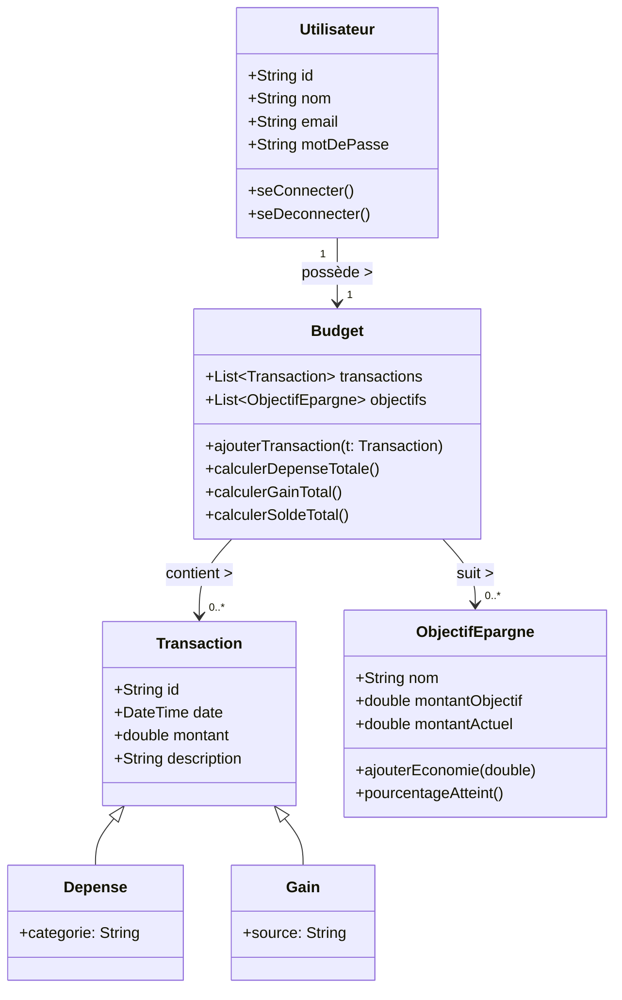

```mermaid
classDiagram

class Utilisateur {
    +String id
    +String nom
    +String email
    +String motDePasse
    +seConnecter()
    +seDeconnecter()
}

class Budget {
    +List~Transaction~ transactions
    +List~ObjectifEpargne~ objectifs
    +ajouterTransaction(t: Transaction)
    +calculerDepenseTotale()
    +calculerGainTotal()
    +calculerSoldeTotal()
}

class Transaction {
    +String id
    +DateTime date
    +double montant
    +String description
}

class Depense {
    +categorie: String
}

class Gain {
    +source: String
}

class ObjectifEpargne {
    +String nom
    +double montantObjectif
    +double montantActuel
    +ajouterEconomie(double)
    +pourcentageAtteint()
}

Utilisateur "1" --> "1" Budget : possède >
Budget --> "0..*" Transaction : contient >
Transaction <|-- Depense
Transaction <|-- Gain
Budget --> "0..*" ObjectifEpargne : suit >

```
